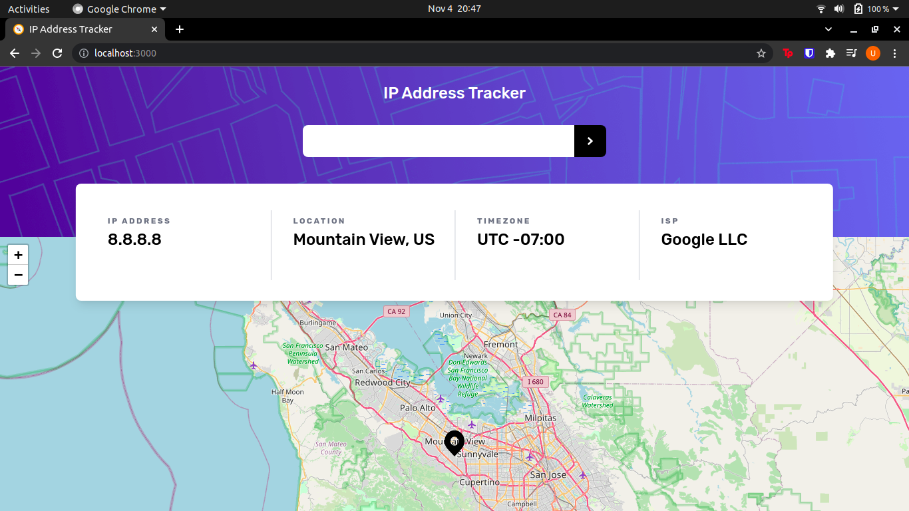
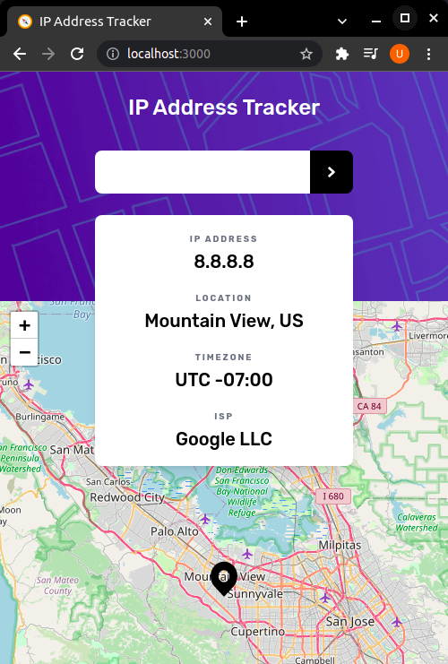

# IP Address Tracker

## Welcome! 👋

This is my solution to the [Frontend Mentor - IP Address Tracker](https://www.frontendmentor.io/challenges/ip-address-tracker-I8-0yYAH0) challenge.

## Mobile design

## Tech Stack

<table>
    <tr>
        <td>
            
        </td>
        <td>
            
        </td>
        <td>
            
        </td> 
    </tr>
</table>

## Live Link

[Live Project Link](https://link)
